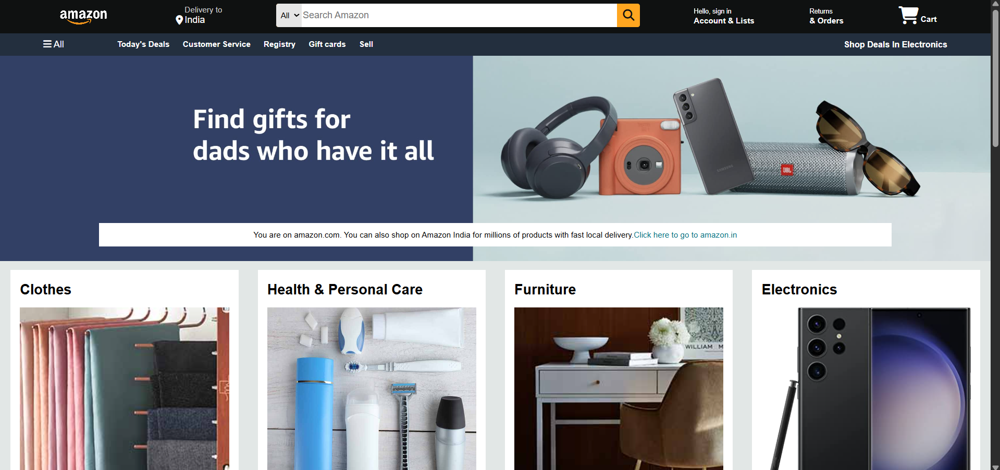

# Amazon Clone (Static Front-End)

This is a static front-end clone of the Amazon homepage built using **HTML** and **CSS**. The goal of this project was to practice webpage layout, styling, and structure by recreating one of the most popular e-commerce websites.

> 🚫 This project does not include any backend or functional features (like cart, login, or product search).

## 📸 Preview

## 🛠️ Technologies Used

- HTML5
- CSS3
- JavaScript

